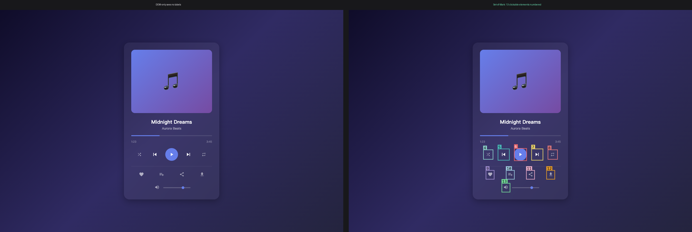
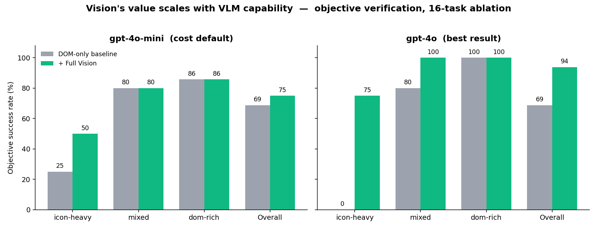
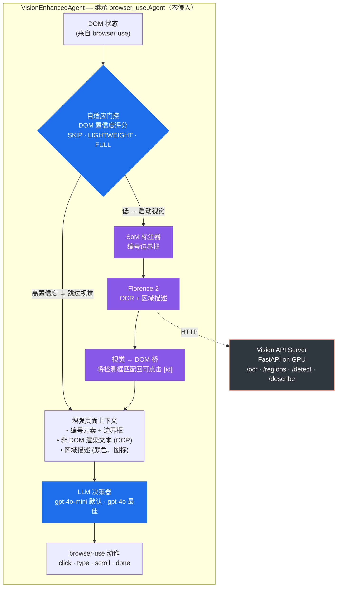

中文 | [English](README_en.md)

# 🔍 Browser-Use 视觉增强

[](https://github.com/Raidriar7170/browser-use-vision/actions/workflows/tests.yml)
[](https://www.python.org/downloads/)
[](LICENSE)
[](https://github.com/astral-sh/ruff)

**为 [browser-use](https://github.com/browser-use/browser-use)（⭐ 94k）浏览器 Agent 框架提供视觉 Grounding 增强插件——让 Agent 不仅能读 DOM，还能"看见"页面。**

---

## ⚡ 一句话总结

> **在 DOM 完全无法解析的纯图标 UI 上，加入视觉管线后 gpt-4o 浏览器 Agent
> 从 `0/4 → 3/4`，整体客观成功率从 `69% → 94%`（+25%）。**

`94% 客观成功率 · 比纯 DOM +25% · 纯图标 UI 0/4 → 3/4`
——所有数字来自**客观校验**（DOM 状态 / URL / 实时 API），绝非 Agent 自我评分。



*左：纯图标音乐播放器——每个控件都是无文本/aria-label 的 `<svg>`，DOM 无法解析。
右：Set-of-Mark 为 VLM 提供每个可点击元素的编号句柄。*



*同一套 SoM + Florence 管线，唯一变量是驱动 LLM。弱 VLM (gpt-4o-mini) 几乎无法利用
grounded boxes；gpt-4o 将其转化为 +25% 增益。**瓶颈是 VLM，不是管线。***

---

## 🎯 为什么需要这个项目

现代浏览器 Agent 依赖 DOM 解析理解页面。但以下场景 DOM 无能为力：

| 场景 | 纯 DOM Agent | 视觉增强 Agent |
|------|:-:|:-:|
| 纯图标按钮（无文本/aria 标签） | ❌ 无法区分 | ✅ 通过视觉形状识别 |
| 颜色选择器 / 视觉选择器 | ❌ 无颜色感知 | ✅ 通过外观识别 |
| Canvas / SVG 渲染内容 | ❌ DOM 不可见 | ✅ OCR + 区域检测 |
| 动态 SPA（懒加载内容） | ⚠️ 可能提前行动 | ✅ 视觉确认内容就绪 |

---

## ✨ 核心结果

> **以下所有成功率均来自客观校验**——Agent 完成后检查真实 DOM 状态、页面 URL 或
> 实时 ground-truth API。成功**绝非** Agent 自报 `done()`。

### 最佳结果 (gpt-4o)：视觉救回纯图标 UI

| 指标 | 基线 (纯 DOM) | **+ 全视觉** |
|---|:-:|:-:|
| **总体** (16 任务) | 11/16 (69%) | **15/16 (94%)** |
| **icon-heavy** (4 任务) | **0/4 (0%)** | **3/4 (75%)** |
| mixed (5 任务) | 4/5 (80%) | **5/5 (100%)** |
| dom-rich (7 任务) | 7/7 (100%) | 7/7 (100%) |

**整体 +25%**，完全由 icon-heavy 类别驱动——像素胜过 DOM 的精确场景。

### 核心发现：视觉的价值随 VLM 能力扩展

同一套消融实验（6 条件、同一 SoM + Florence + 视觉→DOM 桥、相同任务和校验器），
`gpt-4o-mini` vs `gpt-4o`：

| 指标 | gpt-4o-mini（成本默认） | **gpt-4o（最佳）** |
|---|:-:|:-:|
| 基线 (纯 DOM) | 11/16 (69%) | 11/16 (69%) |
| 全视觉 (最强条件) | 12/16 (75%) | **15/16 (94%)** |
| 全视觉增益 | +6% | **+25%** |
| **icon-heavy**: 基线 → 全视觉 | 1/4 → 2/4 | **0/4 → 3/4** |
| 自适应 (E) 视觉调用 vs 全量 | 15 vs 35 | 20 vs 37 |

两个模型共享**相同的 69% 纯 DOM 基线**——+25% 的差距完全来自强 VLM *利用*了弱 VLM 忽略的 grounded boxes。

### gpt-4o-mini 作为低成本默认

代码和示例默认使用 gpt-4o-mini（便宜）。该模型下全视觉增益较小（+6%），
自适应门控与基线持平——但在需要像素的类别上，自适应以 43% 的视觉预算追平了全视觉。
换成 gpt-4o 同一门控即超越基线 +25%。

---

## 🏗️ 系统架构



**关键设计**：整个模块是**无侵入扩展**——`VisionEnhancedAgent` 通过类继承
`browser_use.Agent`，不修改上游任何一行代码。`pip install --upgrade browser-use` 不会有任何影响。

---

## 🚀 快速开始

### 60 秒看它工作（无需 GPU）

README 顶部的两张图可以在**本地无 GPU、无视觉服务器**的情况下重新生成：

```bash
pip install -e ".[dev]"

# 1. 启动本地 HTML fixture 服务
python3 -m http.server 8088 --directory demo/ &

# 2. 重新生成 SoM hero 图
python scripts/make_hero_image.py \
  --url http://localhost:8088/icon_only_player.html \
  --out docs/assets/som_icons.png

# 3. 从已提交的消融 JSON 重新生成结果图表
python3 scripts/make_results_chart.py   # → docs/assets/results.png
```

无需 CUDA、无需 Florence 服务器、无需 API key。**完整**视觉管线（实时 Agent 运行）
需要下面的 GPU 视觉服务器。

### 安装

```bash
git clone https://github.com/Raidriar7170/browser-use-vision.git
cd browser-use-vision
pip install -e ".[dev]"
playwright install chromium
```

### 1. 启动 Vision API Server（GPU 机器）

```bash
pip install torch transformers
python -m browser_use_vision.server --port 8100
curl http://localhost:8100/health
# → {"status": "ok", "backend": "FlorenceBackend"}
```

服务器加载 Florence-2-large (~3GB)，暴露端点：
`/ocr` · `/regions` · `/detect` · `/describe`

### 2. 使用 VisionEnhancedAgent

```python
import asyncio
from browser_use.browser.session import BrowserSession
from browser_use_vision.enhanced_agent import VisionEnhancedAgent
from browser_use_vision.grounding.florence import FlorenceBackend

async def main():
    session = BrowserSession(headless=True)
    backend = FlorenceBackend(remote_url="http://localhost:8100")

    agent = VisionEnhancedAgent(
        task="Click the 'Next Track' button on this music player",
        llm=ChatOpenAI(model="gpt-4o-mini"),
        browser_session=session,
        vision_backend=backend,
        use_vision=True,
        enable_som=True,
        enable_adaptive=False,
    )

    history = await agent.run()
    print("Done:", history.final_result())

asyncio.run(main())
```

### 3. 运行测试

```bash
pytest tests/ -v              # 140 单元测试
pytest tests/ --cov=browser_use_vision --cov-report=term-missing
python scripts/e2e_test.py    # E2E 集成测试（需 Vision API）
```

---

## 🔬 技术细节

### 1. SoM (Set-of-Mark) 标注

在截图上为交互元素叠加编号标签，让 LLM 在决策时有视觉参照索引。
纯 DOM 几何 + Pillow 绘制，**不需要 GPU**。

### 2. Florence-2 视觉后端

[Florence-2](https://huggingface.co/microsoft/Florence-2-large)（微软）统一视觉基础模型：
- **`OCR_WITH_REGION`** — 提取渲染文本 + 边界框坐标（读取 Canvas/SVG/自定义字体）
- **`DENSE_REGION_CAPTION`** — 为检测到的区域生成描述（识别图标、颜色、形状）

### 3. 自适应视觉策略

不是每个页面都需要昂贵的视觉推理。自适应策略先评估序列化 DOM：

```
DOM 置信度评分 (0-1):
  → 高 (≥0.8): 交互元素有文本/aria/alt 标签 → 跳过视觉
  → 中 (0.5-0.8): 部分有标签、部分空白 → LIGHTWEIGHT（仅 OCR）
  → 低 (<0.5): 纯图标按钮、折叠 <svg>、无可读标签 → FULL 视觉
  (连续失败或检测到循环强制 FULL)
```

评分公式：`0.4 + 0.6 × (labeled ÷ total_interactive)`，减去折叠 `<svg>` 的小惩罚。

### 4. VisionEnhancedAgent

`browser_use.Agent` 的无侵入子类扩展：

```
每步管线：
  1. 截图
  2. SoM: 为交互元素标注编号
  3. Florence-2: OCR + 区域检测
  4. 合并: DOM 树 + 视觉描述
  5. LLM: 用增强上下文决策动作
  6. 执行: browser-use 动作 (click, type, etc.)
```

---

## 🔬 成功判定方法论

早期版本用 Agent 调用 `done()` 作为成功标志——Agent 自己给自己打分。
这会虚高数字：Agent 经常报告"成功点击 Next Track 按钮"但 DOM 实际无变化。

本仓库所有 benchmark 使用**客观校验**。`agent.run()` 完成后，per-task
`verify(page, final_result)` 检查真实的 post-run 状态：

| 校验器 | 检查内容 | 用途 |
|--------|---------|------|
| `dom_js(expr)` | 活页面中 JS 表达式为 truthy | 动作类任务 |
| `url_has(*subs)` | 最终 URL 包含子串 | 导航任务 |
| `text_has(*subs)` | Agent 答案包含预期文本 | 静态提取任务 |
| `live_hn_top()` | 答案匹配 Hacker News 实时 #1（Firebase API） | 动态提取 |

任务集：**16 个任务**——6 个本地纯图标 fixture + 10 个公开网站
(Wikipedia, Hacker News, arXiv, toscrape.com, the-internet.herokuapp.com)。

---

## 📊 消融实验 (6 条件 × 16 任务 = 96 次运行)

| 条件 | 描述 | 成功率 | 平均步数 | 视觉调用 |
|------|------|:----:|:------:|:-------:|
| A. 基线 | 纯 DOM，无视觉，无 SoM | 11/16 (69%) | 1.7 | 0 |
| B. 仅 SoM | SoM 标注，无视觉模型 | 10/16 (62%) | 2.4 | 0 |
| **C. 全视觉** | **OCR + 区域描述每步** | **12/16 (75%)** | 2.3 | 35 |
| D. 仅 OCR | 每步仅 OCR，无区域描述 | 11/16 (69%) | 2.3 | 36 |
| **E. 自适应** | **SoM + DOM 门控视觉（默认配置）** | 11/16 (69%) | 2.3 | **15** |
| F. 无 SoM 自适应 | 自适应视觉，无 SoM | 9/16 (56%) | 1.4 | 9 |

数据：[`ablation_results.json`](output/benchmark_results/ablation_results.json)
| 报告：[`ablation_report.md`](output/benchmark_results/ablation_report.md)
| gpt-4o 报告：[`ablation_report_gpt-4o.md`](output/benchmark_results/ablation_report_gpt-4o.md)

---

## 🛠️ 技术栈

| 组件 | 技术 | 用途 |
|---|---|---|
| 核心运行时 | Python 3.11 | 语言 |
| 浏览器 Agent | browser-use 0.12.9 | 上游 Agent 框架 |
| 浏览器引擎 | Playwright + Chromium | 浏览器自动化 |
| 视觉模型 | Florence-2-large (Microsoft) | OCR、区域检测、描述 |
| 视觉 API | FastAPI + Uvicorn | GPU 推理服务 |
| LLM | GPT-4o-mini (via OpenAI API) | Agent 决策 |
| 深度学习 | PyTorch 2.1 + transformers | 模型推理 |
| 数据模型 | Pydantic v2 | Schema 校验 |
| 测试 | pytest + pytest-asyncio | 单元与集成测试 |
| CI/CD | GitHub Actions | 自动化测试流水线 |
| 图像处理 | Pillow | 截图处理 |

---

## 🗺️ 路线图

- [x] Florence-2 视觉后端（OCR + 区域检测）
- [x] SoM (Set-of-Mark) 截图标注
- [x] 自适应视觉策略（DOM 置信度评分）
- [x] E2E 集成测试 + HTML fixtures
- [x] CI 流水线（GitHub Actions）— 140 单元测试
- [x] **客观成功校验**（DOM / URL / 实时 API，非 Agent 自报）
- [x] 16 任务 benchmark + 消融实验（6 条件 × 16 任务）
- [x] **修复 + 重调自适应视觉门控**
- [~] OmniParser V2 后端（代码完成，待集成测试）
- [ ] GroundingDINO 作为替代检测后端
- [ ] 从 Agent trace 学习门控阈值
- [ ] 对标 WebArena / Mind2Web 评测
- [ ] 视频流模式（实时 Agent 观测）

---

## 📄 许可证

MIT License. 详见 [LICENSE](LICENSE)。

---

## 📌 项目总结

> **面向招聘者：**
>
> 本项目展示了构建**生产级 ML 浏览器 Agent 增强系统**的全栈工程能力：
>
> - **系统设计** — 为热门开源框架（94k ⭐）设计无侵入插件架构，零上游修改
> - **ML 工程** — 部署 Florence-2 视觉基础模型为 GPU 推理服务；
>   设计 SoM 标注管线实现视觉定位
> - **性能优化** — 自适应推理基于 browser-use 索引序列化 DOM 的置信度评分门控视觉
>   调用：**全套 15 次视觉调用 vs 全开 35 次（仅 43% 预算），并在视觉真正起作用的
>   图标类任务上追平全视觉（2/4）**
> - **量化结果** — 16 个任务、**客观校验**（DOM / URL / 实时 API，非 Agent
>   自报）：在 **gpt-4o** 下视觉管线达到 **94%（15/16）vs 基线 69%（+25%）**，
>   并将纯图标 UI 从 **0/4 救回 3/4**；在更便宜的 gpt-4o-mini 默认模型上同一
>   管线仍优于基线（+6%）——视觉的价值随 VLM 能力扩展。消融实验（6 条件 ×
>   16 任务、两个模型）量化各组件真实贡献，并推翻了早期自报指标的结论。
>   含 140 单元测试 + 3 个 E2E 集成场景（全部通过）
> - **工程规范** — 1800 行核心模块、140 单元测试、3 个 E2E 集成测试、
>   CI 流水线、类型化 Python 代码
